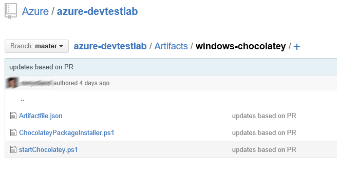

# Authoring Artifacts

An Artifact consists of an artifact definition file and other script files that are stored
in a folder in a git repository. Artifact definition file consists of JSON and expressions
which you can use to specify what you want to install on a machine. For example, you can 
define the name of artifact, command to run and parameters that are made available when 
command is run. You can refer to other script files within artifact definition file using 
their name.
 
## Concepts
-------------------------------------------------------------------------------
### __Artifact definition file format__

The following example shows the sections that make up the basic structure of a definition 
file.

    {
      "$schema": "https://raw.githubusercontent.com/Azure/azure-devtestlab/master/schemas/2016-11-28/dtlArtifacts.json",
      "title": "",
      "description": "",
      "iconUri": "",
      "targetOsType": "",
      "parameters": {
        "<parameterName>": {
          "type": "",
          "displayName": "",
          "description": ""
        }
      },
      "runCommand": {
        "commandToExecute": ""
      }
    }

|Element Name |Required |Description
|-------------|:--------|:-----------
|$schema      |No       |Location of the JSON schema file that helps in testing the validity of the definition file.
|title        |Yes      |Name of the Artifact that is displayed in Lab
|description  |Yes      |Description of the Artifact that is displayed in Lab
|iconUri      |No       |Uri of the icon that will be displayed in the Lab
|targetOsType |Yes      |Operating System of the machine where artifact will be installed. Supported options are: Windows and Linux
|parameters   |No       |Values that are provided when artifact install command is run on a machine. This helps in customizing your artifact.
|runCommand   |Yes      |Artifact install command that is executed on a machine. 

-------------------------------------------------------------------------------
### __Parameters__

In the parameters section of the definition file, you specify which values a user can input when installing an artifact. You can refer to these values in the artifact install command. 
You define parameters will the following structure:

    "parameters": {
        "<parameterName>": {
          "type": "<type-of-parameter-value>",
          "displayName": "<display-name-of-parameter>",
          "description": "<description-of-parameter>"
        }
      }

|Element Name |Required |Description
|:------------|:--------|:----------
|type         |Yes      |Type of parameter value. See the list below of the allowed types.
|displayName  |Yes      |Name of the parameter that is displayed to a user in Lab
|description  |Yes      |Description of the parameter that is displayed to a used in Lab

The allowed types are:
- string – any valid JSON string 
- int – any valid JSON integer
- bool – any valid JSON Boolean
- array – any valid JSON array

### __Expression and Functions__

You can use expression and functions to construct the artifact install command.

Expressions are enclosed with brackets ([ and ]), and are evaluated when the artifact is
installed. Expressions can appear anywhere in a JSON string value and always return 
another JSON value. If you need to use a literal string that starts with a bracket [, 
you must use two brackets [[. 

Typically, you use expressions with functions to construct a value. Just like in 
JavaScript, function calls are formatted as functionName(arg1,arg2,arg3)

The following list shows common functions.
- parameters(parameterName)

  Returns a parameter value that is provided when artifact command is run

- concat(arg1,arg2,arg3, …..)

  Combines multiple string values. This function can take any number of arguments.
  

The following example shows how to use expression and functions to construct a value. 

    runCommand": { 
      "commandToExecute": "[concat('powershell.exe -ExecutionPolicy bypass \"& ./startChocolatey.ps1'
        , ' -RawPackagesList ', parameters('packages')
        , ' -Username ', parameters('installUsername')
        , ' -Password ', parameters('installPassword')
        , '\"')]" 
    }

-------------------------------------------------------------------------------

## Getting Started

Create your custom artifact by following steps below:
- Install a JSON editor

  You will need a JSON editor to work on artifact definition file. We recommend using 
  Visual Studio Code which you can install from here. Visual Studio Code is available 
  for Windows, Linux and OS X.
  
- Get a Sample Artifactfile.json.
  
  Check out artifacts created by Azure DevTest Labs team at our GitHub repository. We have 
  created a very rich library of artifacts which will help you to create your own 
  artifacts. Download an artifact definition file and make changes to it to create 
  your own artifacts.
  
  Azure DevTest Labs Team Repository: https://github.com/Azure/azure-devtestlab
  
- Make use of intellisense

  Take help of intellisense to see valid elements that can be used to construct artifact 
  definition file. You can also see different options for values of an element. For 
  example, intellisense will tell you to choose Windows or Linux for targetOsType element.

- Store Artifact in git repository

  1. Create a separate folder for each artifact with name as the artifact name.
  2. Store artifact definition file (Artifactfile.json) in the folder.
  3. Store all the scripts that you have referenced in the artifact install command.
  
     Here is how an artifact folder might look:
     
     
 

- Add an Artifacts Repository in Lab

  Please [check out instructions here](https://azure.microsoft.com/en-us/documentation/articles/devtest-lab-add-artifact-repo/) to add an Artifacts Repository in Lab
