***Azure DevTest Lab Overview – Ethereum Getting Started***

This lab will have you create a private multi-node Ethereum network in Azure and begin working with Ethereum addresses and transferring Ether between them.  The lab itself will consist of a single private Ethereum network, with each participant having a Ethereum node on the network under their full control. Participants will seed the blockchain, create addresses, begin mining and transfer ETH to each other. If there is only one participant you can choose to only create a single host or multiple hosts if you choose.

For this lab we choose not to use Docker until the configuration of the Ethereum runtime has become more clear. There is a Go Ethereum Docker image ready to go, however there are some questions concerning mining performance and the configuration required to allow for consistent proof of work mining across experiment participants.

Lab Instructions
Lab Highlights:
* Create a private Ethereum network
* Allow for participants to create VM Nodes within this network
* Create an address on this network, storing and managing the private key 
* Begin to mine the blockchain and escrow ETH generated until other participants join and mine ETH. Accounts can transfer to other participants to generate minable transactions
* Mine Ether (ETH) depositing into their address
* Transfer ETH to another participant/address
* Receive ETH from another participant/address
* View the Accounts Balance 

**Lab Zero Initialization**

Lab initialization parameters:

*Genesis Seed*

    {
     "alloc": {},
     "nonce": "0x0000000000000042",
     "difficulty": "0x0400",
     "mixhash": "0x0000000000000000000000000000000000000000000000000000000000000000",
     "coinbase": "0x0000000000000000000000000000000000000000",
     "timestamp": "0x00",
     "parentHash": "0x0000000000000000000000000000000000000000000000000000000000000000",
     "extraData": "0x11bbe8db4e347b4e8c937c1c8370e4b5ed33adb3db69cbdb7a38e1e50b1b82ee",
     "gasLimit": "0x4c4b40"
    }
* Startup: `geth --genesis lab-seed.json --rpc --rpcport "8080" --rpccorsdomain "*" --datadir "chains/devtest" --port "2402" --ipcapi "admin,db,eth,debug,miner,net,shh,txpool,personal,web3" --rpcapi "db,eth,net,web3" --networkid 1001201 console`
* Seed files and startup scripts copied during installation
o Seed-blockchain.sh – run the blockchain for 1st time
o Start-blockchain.sh – run after seeded
o attachOne.sh – attach console

**Lab – Step by Step**

**Participants in this lab will do the following:**
- Add their own Ethereum Node to the Private lab1 blockchain

- Sync the blockchain onto their node

- Add an account to the network

- Start mining the lab1 blockchain

- Receive funds from another account for joining the network

- Transfer and receive funds from new participants in the network

- View and validate the transactions and balances

**Joining and Adding a Node to the DevTest Lab Steps**

- 1. Sign into with your Azure account

	a. [http://portal.azure.com](http://portal.azure.com)

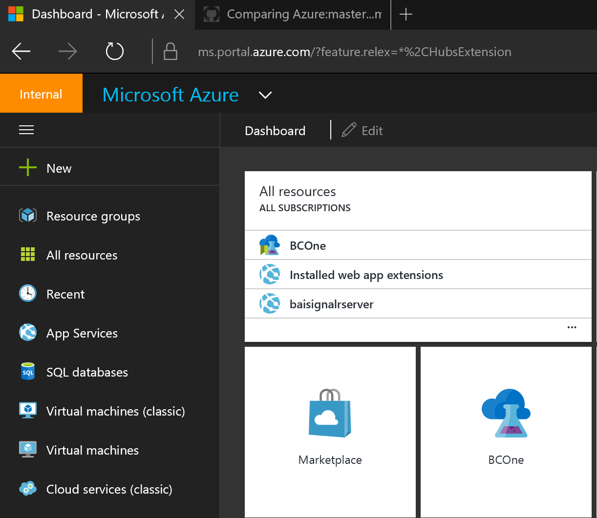

- 2. Add DevTest Labs to your left navigation

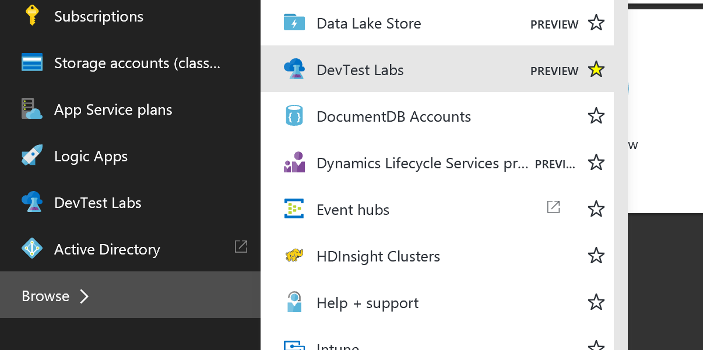

- 3. Create a new DevTest Lab

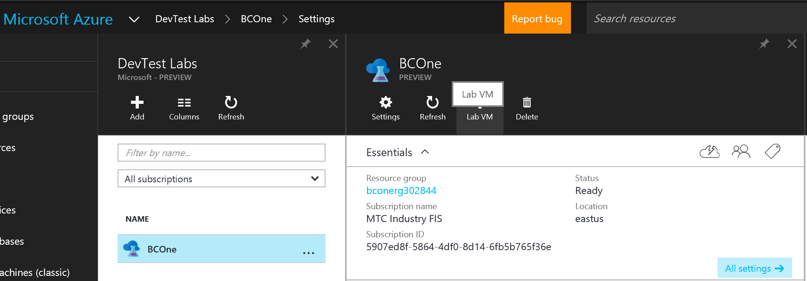

- 4. Once created, create a new Lab VM

- 5. Name the VM 
- 6. Select Ubuntu Base

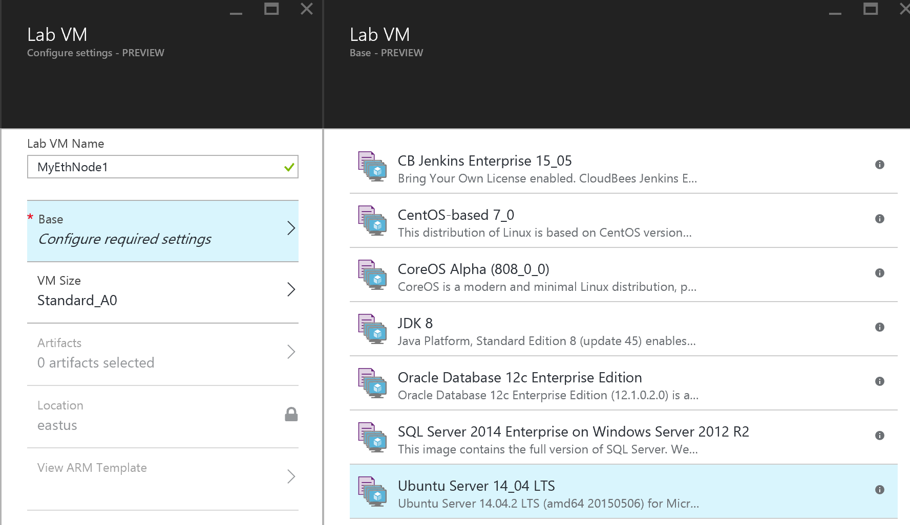

- 7. Create a Admin account and password – save this information as you will be the only one with it.

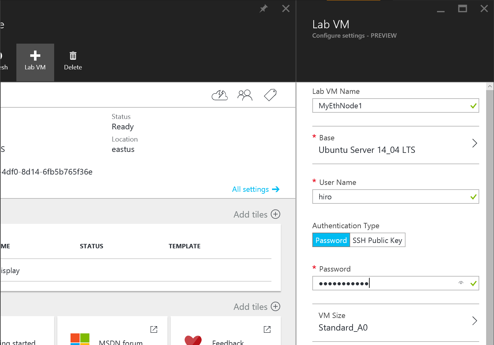

- 8. Select Azure Machine A2 as your Machine size. (You can go larger…but not required)

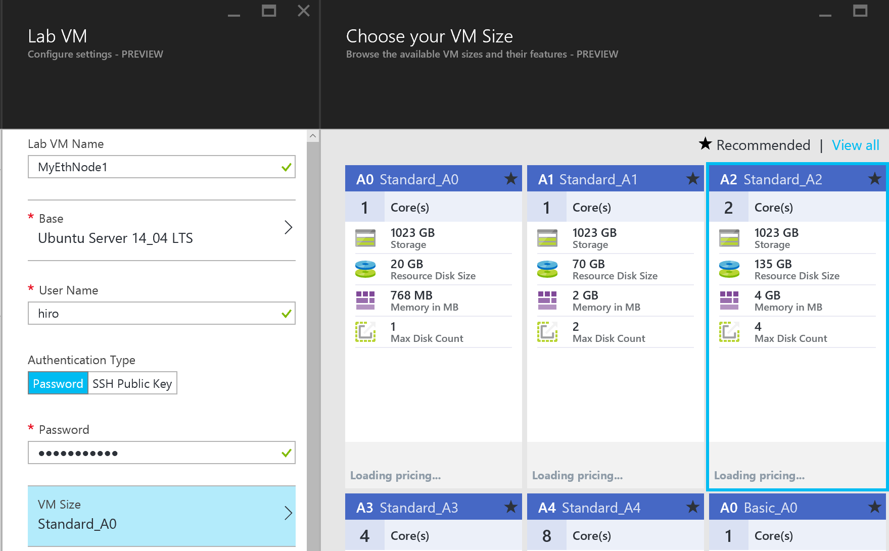

- 9. Select Go-Ethereum-Linux as your artifact 

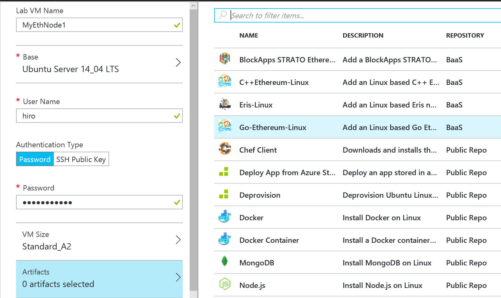

- 10. Make sure the User and Admin names are the same

- 11. Select Create and wait a few minutes for the installation to complete

**If you do not have SSH capabilities you can install a tool like Putty [http://www.putty.org/](http://www.putty.org/) while you are waiting*

- 12. Drill into your node
- 13. Copy the IP or DNS address so you can SSH into it

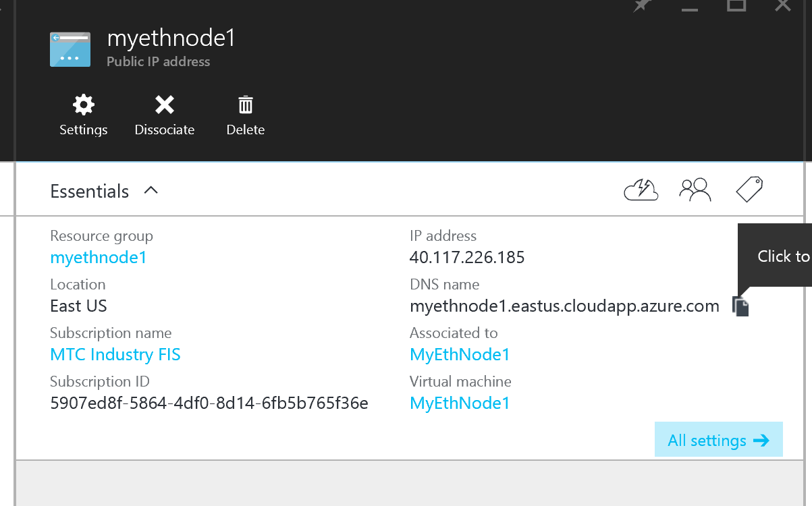

- 14. Open a SSH client like PuTTY and paste your node IP or DNS address in to connect.

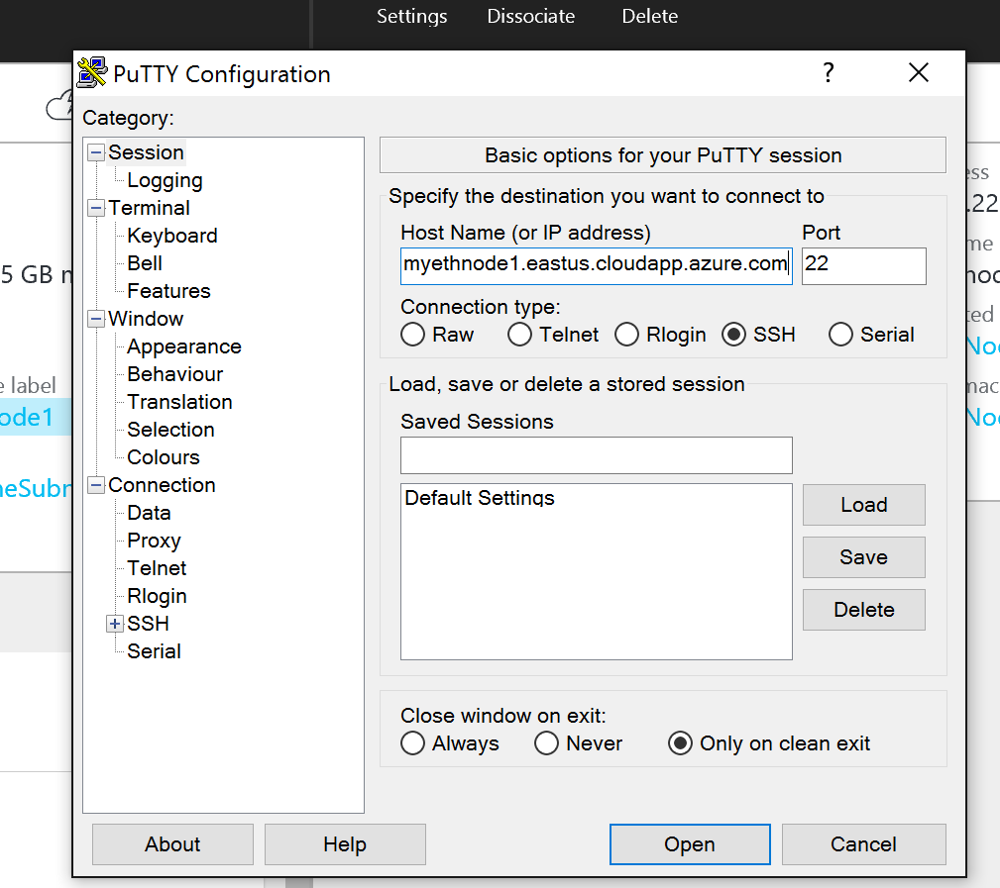

- 15. Select Yes to the warning 
- 16. Login using your admin account

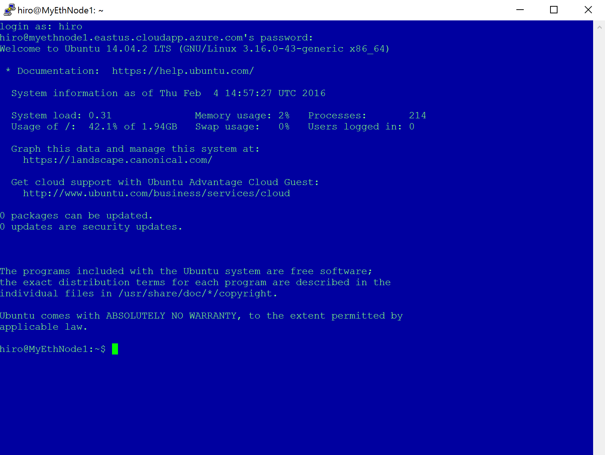

- 17. Note the script for starting your node: `ls`
- 18. Run your node to start Blockchain synchronization using: `sh seed-blockchain.sh`
- 19. Open up another SSH window to your host
- 20. Run Geth: geth attach ipc:chains/devtest/geth.ipc
- 21. Create your account: personal.newAccount()

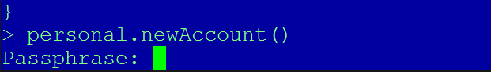

- 22. Type in a passphrase. This is your PRIVATE KEY…so don’t lose it!
- 23. **If this is the second node once your Node has completed Syncing the Blockchain, you are ready to start mining, but you may want to wait to start mining so you can easily see the Eth balance changes. From your new SSH window type:* **`miner.start()`**
.png)
- 24. **OPTIONAL** Repeat steps 4-23 to create a second node on you network
- 25. Once the DAG (distributed acyclic graph) is completed the database is ready to be distributed
- 26. Now, to transfer some ETH between accounts. If you have multiple nodes you can transfer between the accounts you created on each node, if you only have one node…just create another account and transfer to that one. Using the SSH Shell that is not mining…first check your balance:
`eth.getBalance(eth.coinbase)`
- To send Ether, you will need to have a different address, replace the highlighted address with that one. Also, you can put some data if you want to as well.
    
    `eth.sendTransaction({from: eth.coinbase, to: "0x9652e1692177be47779a2fd5f647433c6bfeec17", value: web3.toWei(1, "ether"),gas:22000,gasPrice:web3.toWei(45,"Shannon"),data: web3.toHex('mytransaction')})`
    
- *Change the address to another address on the network, you can create as many as you want using their "0x965332..." addresses.*
- 27. Now check your balance: eth.getBalance(eth.coinbase)
- 28. Now view your transactions: Copy and paste your transaction ID that is output after the `eth.sendTransaction` command.
- 29. Then:`eth.getTransaction("0x2820dfb6930e6f4fb7df61863661510614e4f988eb2c1e692e9c3e4fd3cf8e56")`

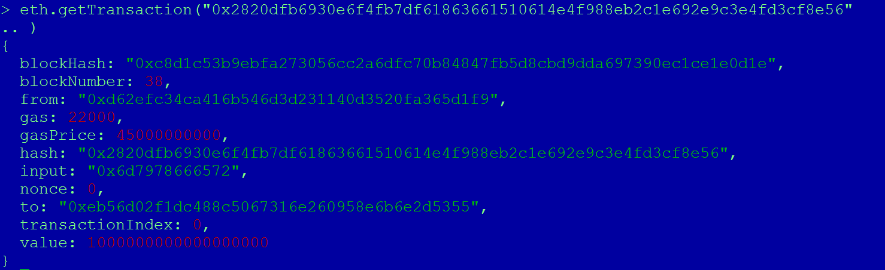

- 30. Lab Complete!

