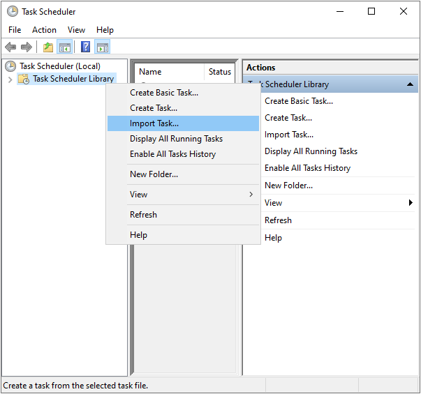
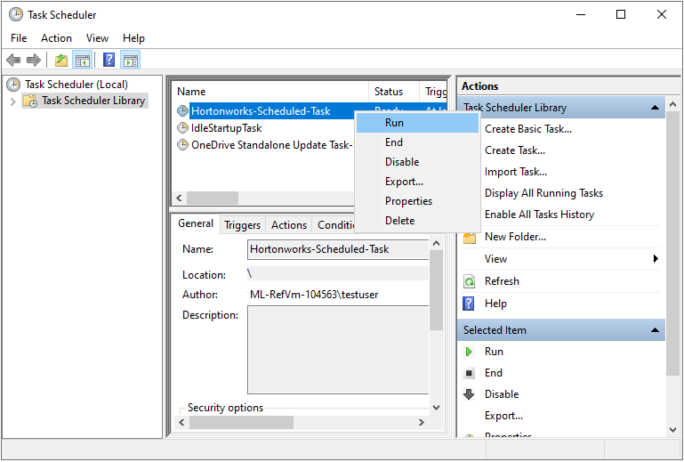
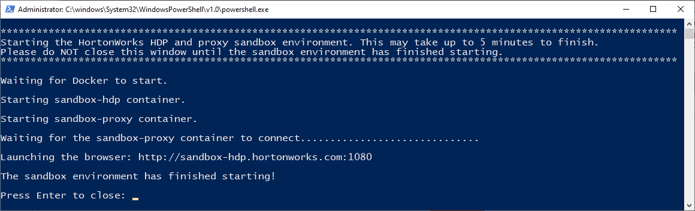

# Introduction
To provide students with an easy-to-use experience for a big data analytics class that uses [Hortonworks Data Platform's](https://www.cloudera.com/products/hdp.html) (HDP) Docker deployment, this PowerShell script automatically:
- Starts the HDP's Docker containers when a student logs into their VM.
- Launches the browser and navigates to the [Sandbox Welcome Page](https://www.cloudera.com/tutorials/learning-the-ropes-of-the-hdp-sandbox.html#welcome-page).

Windows Task Scheduler is used to automatically run this script when the student logs into their VM.

> [!NOTE] This script assumes that you have already installed Docker and deployed Hortonworks Data Platform.  Refer to the article on the [Big Data Analytics](https://docs.microsoft.com/azure/lab-services/classroom-labs/class-type-ethical-hacking) class type for more information.

## Directions
1. [Connect to the template machine](https://docs.microsoft.com/azure/lab-services/classroom-labs/how-to-create-manage-template#update-a-template-vm) for your class.
1. Download the **Start-Hortonworks-DockerContainers.ps1** PowerShell script and the **Hortonworks-Scheduled-Task.xml** Windows Task Scheduler file onto the template machine through one of these ways:
     - Clone this repository
     - Manually download the files
     - Use Invoke-WebRequest to download the files:
          > Invoke-WebRequest "https://raw.githubusercontent.com/Azure/azure-devtestlab/master/samples/ClassroomLabs/BigDataAnalytics/Start-Hortonworks-DockerContainers.ps1" -OutFile Start-Hortonworks-DockerContainers.ps1

          > Invoke-WebRequest "https://raw.githubusercontent.com/Azure/azure-devtestlab/master/samples/ClassroomLabs/BigDataAnalytics/Hortonworks-Scheduled-Task.xml" -OutFile Hortonworks-Scheduled-Task.xml
 
    > [!WARNING] Ensure that you download the files to a directory location that does *not* include whitespace in the file path.  Whitespace can have negative side effects with Windows Task Scheduler.
1. Open the Windows Task Scheduler xml file (e.g. **Hortonworks-Scheduled-Task.xml**) and update it so that it points to the correct path of the PowerShell script (e.g. **Start-Hortonworks-DockerContainers.ps1**). For example, if you have downloaded both files to C:\BigDataAnalytics, update the following section in **Hortonworks-Scheduled-Task.xml**:

    ```xml
    <Actions Context="Author">
        <Exec>
        <Command>powershell.exe</Command>
        <Arguments>-ExecutionPolicy Bypass "C:\BigDataAnalytics\Start-Hortonworks-DockerContainers.ps1"</Arguments>
        </Exec>
    </Actions>
    ```
1. Open Windows Task Scheduler, right-click on **Task Scheduler Library** and select **Import Task**.  Browse to the location of **Hortonworks-Scheduled-Task.xml** file and click **Open** to complete the import.
   
1. Finally, test this task by:
   - Running the task within Windows Task Scheduler.  To do this, right-click on the task and select **Run**.
      
   - Disconnect from the template machine, restart it, and log in.  The task should automatically run when you log in.
  In both cases, you should see the PowerShell script run, the Docker containers start, and then the browser launch to http://localhost:1080.
   
1. After you have tested this on your template machine, you can now [publish](https://docs.microsoft.com/azure/lab-services/classroom-labs/how-to-create-manage-template#publish-the-template-vm) to create the students' machines.  Now, when your students log into their machines, they also will see the Docker containers automatically start and the browser open to http://localhost:1080.
