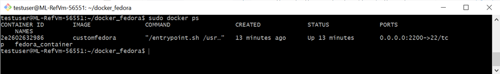

# Introduction
The Azure marketplace provides hundreds of Windows and Linux images that include a variety of common applications already preinstalled, such as SQL Server, Office, and more.  When you create your lab, you can select an image from the marketplace and then customize it further by installing additional software based on the unique needs for your class.  You can then export this custom image to the [Shared Image Gallery](https://docs.microsoft.com/azure/lab-services/classroom-labs/how-to-use-shared-image-gallery) so that you can reuse your image to create other labs.  This is the easiest approach for creating and reusing a custom image and is well-suited for most types of classes.
Even with the wide selection of images in the marketplace and the ability to customize them, you may still run into scenarios where this doesn’t suit your needs.  

One option is to use a Docker container image.  With this option, you have access to over [100,000 Docker container images from software vendors, open-source projects, and the community](https://hub.docker.com/).  Or you can choose to use custom Docker images that you create.

This sample shows how to use a Docker container image in your lab.

## Using Docker
Using a Docker container image may be a suitable option when an image that you need isn’t currently available in the marketplace.  Let’s look at an example of this with a lab that needs to be created based on the Linux distro, Fedora.  Here are some things to note about Fedora:

- Fedora isn’t currently an [officially endorsed distro by Azure](https://docs.microsoft.com/azure/virtual-machines/linux/endorsed-distros). 
- A marketplace image for Fedora isn’t currently available for use with AzLabs.
- It currently isn’t possible to create your own custom Fedora image using the VHD file approach mentioned in bullet #2 above.
  
However, Fedora does provide an [official Docker container image](https://hub.docker.com/_/fedora) that you can use to run Fedora within a Docker container on each student’s VM.  Each Docker container provides its own isolated environment for software applications to run inside.  Conceptually, Docker containers are like nested VMs and can be used to easily deploy and run a wide variety of software applications based on container images provided by [Docker Hub](https://www.docker.com/products/docker-hub) and other container registries.


The above diagram shows how this configured – here are key points:
-   Students can directly use SSH and a GUI desktop client (such as X2Go) to connect to the Docker container (e.g. Fedora) from their local computer.  This is made possible by:
    -   Creating an SSH tunnel between the student’s computer.
    -   Forwarding port 22 from the Docker container to the host lab VM.
-   The student’s lab VM that hosts the Fedora Docker container uses Ubuntu.  Although you could use Windows as the host VM’s OS, Ubuntu is used in this configuration because it has a few advantages:
    -   Currently, to create Linux Docker containers on Windows hosts, this requires that you have Hyper-V enabled on the student’s VM which means you must use a [compute size](https://docs.microsoft.com/azure/lab-services/classroom-labs/administrator-guide#vm-sizing) that supports nested virtualization.  If you instead use a Linux distro as the host OS, you can use a smaller compute size.
    -   AzLabs Azure Lab Services doesn’t currently open port 22 on Windows lab VMs.  This prevents creating an SSH tunnel so that students can directly connect to the Docker container on the lab VM.  Instead, students must first RDP to their lab VM to be able to access the Docker container if you use Windows as the host VM’s OS.

## Directions
Next, let’s walk through the high-level steps for configuring a lab that runs a Fedora Docker container on the student’s lab VM.

### Prepare the template VM

1.	[Create your lab](https://docs.microsoft.com/azure/lab-services/classroom-labs/how-to-manage-classroom-labs#create-a-classroom-lab) – in this example, let’s use the following settings:
    -   Medium compute size (4 Cores, 7 GB RAM)
    -   Ubuntu Server 16.04 LTS

1. Once the lab is created, connect to the template VM using SSH.  

1.  Then, install [Docker engine](https://docs.docker.com/engine/install/) which is used to run and manage Docker containers on the VM.  For our example, you should follow the instructions for [installing the latest version of the Docker engine on Ubuntu](https://docs.docker.com/engine/install/ubuntu/#install-using-the-repository).

### Build a custom Docker Fedora image
With Docker, you can use prebuilt images provided by Docker Hub and other container registries; or you can create your own custom container images.  In our example, we’ll build our own custom container image that:
      
-   Is based on the latest version of the [official Docker container image for Fedora](https://hub.docker.com/_/fedora).
-   Installs SSH server package.
-   Installs GUI packages for X2Go and XFCE desktop.
  
Here are steps to build our custom Fedora container image.  These instructions assume that you are still connected to the template VM using SSH:

1.  Download the [Dockerfile](https://docs.docker.com/engine/reference/builder/) and [entrypoint.sh](https://docs.docker.com/engine/reference/builder/#entrypoint) files to the template VM using one of the following ways:
      -    Clone this repository.
      -    Use curl.

    ```bash
    curl -O https://github.com/Azure/azure-devtestlab/tree/master/samples/ClassroomLabs/Scripts/FedoraDockerContainer/Dockerfile -O https://github.com/Azure/azure-devtestlab/tree/master/samples/ClassroomLabs/Scripts/FedoraDockerContainer/entrypoint.sh
    ```

    In our example, we’ll assume these files have been copied to a directory called docker_fedora:

    

    The Dockerfile is required to build the image and the entrypoint.sh script is executed when the container runs.  Also, notice that in the entrypoint.sh file, we have configured the credentials that you will use in later steps to connect using SSH and GUI remote desktop:
      -   **login**: testuser
      -   **password**: Fedora#123

1.  Next, we’ll need to change permissions on the entrypoint.sh file to ensure that it is executable (otherwise you will see a permission denied error when we try to run the container).  Do this by running the following command:
   
    ```bash
    sudo chmod +x entrypoint.sh
    ```
    > IMPORTANT: If you inadvertently skip this step, you will receive the following error when you attempt to run the container later on in the steps: **docker: Error response from daemon: OCI runtime create failed: container_linux.go:349: starting container process caused "exec: \"/entrypoint.sh\": permission denied": unknown.**  To correct this, you’ll need to change the permissions as shown above and rebuild the Fedora container image.
>

3.  Build the custom Fedora container image by running the following command – this will take several minutes to run since it will pull all the necessary packages to the template VM.  Also, ensure that the ‘.’ is included at the end of the command:

    ```bash
    sudo docker build --rm -t customfedora .
    ```

1.  When the build is done, use the following command to verify that you have a Docker container image called customfedora:
   
    ```bash
    sudo docker images
     ```

    

### Create and run a Docker container using the custom image

1.  To run the container with the custom image that we created in the previous step, execute the following command:

    ```bash
    sudo docker run --name fedora_container --restart always -d -p 2200:22 customfedora
    ```

    > NOTE: The restart parameter is used to automatically restart the container whenever the container is stopped.  This will ensure that the container restarts whenever a student turns off\on their VM.

1.  Use the following command to verify that you have a running Docker container called fedora_container that forwards SSH port 22 on the Docker container to port 2200 on the host VM:
   
    ```bash
    sudo docker ps
    ```
    
    

### Connect from your local computer directly to the Docker container

To connect directly from your local computer to the Docker container, you need to complete the following steps on your local computer.  These are the same steps that students would need to follow to connect from their local computer to the Fedora Docker container running on their lab VM:

#### Install a remote desktop client

First, you need to install a remote desktop client on the local computer.  The remote desktop client is used to connect to the GUI desktop of the Fedora Docker container.  For this example, we'll use [X2Go](https://github.com/Azure/azure-devtestlab/tree/master/samples/ClassroomLabs/Scripts/X2GoRemoteDesktop).

#### Create an SSH tunnel

Next, you need to create an SSH tunnel between your local computer and the template VM (or student VM):

1. Ensure the VM is started.
   
1. Copy the SSH connection string for your template VM (or student VM)  Your connection string will look similar to this:

    ```bash
    ssh -p 12345 testuser@ml-lab-00000000-0000-0000-0000-000000000000.centralus.cloudapp.azure.com
    ```

1.  On your local computer, open a terminal or command prompt.  Paste the SSH connection string and add **-L 2200:localhost:2200** into the command string, which creates a “tunnel” between your local computer and the template VM (or student VM).  The final command string should look like this:

    ``` bash
    ssh -p 12345 -L 2200:localhost:2200 testuser@ml-lab-00000000-0000-0000-0000-000000000000.centralus.cloudapp.azure.com
    ```

    Hit Enter to run the command.  When prompted, provide your password to the template VM.  At this point, the tunnel should now be established.  Leave this command window open.

    > IMPORTANT: If you receive the following message, specify **yes** to continue: **The authenticity of host '[ml-lab-00000000-0000-0000-0000-000000000000.central.cloudapp.azure.com]:12345 ([52.191.16.234]:12345)' can't be established.
    ECDSA key fingerprint is SHA256:46MUVWAZ+gKvzUuReiIpfZrrlXACqL+6hrelT8UNT9U.
    Are you sure you want to continue connecting (yes/no)?" then the password.**

#### Connect to the Docker container using X2Go and SSH

1.  Open the X2Go client on your local computer and create a new session using the following settings:
      - **Host**: localhost
      - **Login**: testuser
      - **SSH port**: 2200
      - **Session type**: XFCE

    

1.  Click **OK** to create the session.  Next, click on your session in the right-hand pane.

    

1. When prompted, enter the credentials to connect to the Docker container and click **OK** to start the GUI desktop session.  Remember that the credentials are based on what we configured in the entrypoint.sh file:
   -   **login**: testuser
   -   **password**: Fedora#123

    

1.  Finally, you should now be connected to Fedora's GUI Desktop:

    > IMPORTANT: If you receive the following message, specify **yes** to continue: **The server is unknown. Do you trust the host key? Public key hash: localhost:2200 - 7b:34:xxxxxx Yes/No**
   
    

    After following the above steps to set up your template VM, you can then publish your lab.  Students will be able to directly connect to the Fedora Docker container on their assigned VM by creating the SSH tunnel and then using a GUI desktop client, such as X2Go.  To do this, students will also need to follow the steps outlined above on their local computer.

2.  Remember to stop your VM when you are done.

#### Next steps
This sample showed how you can use Docker images in your lab.  Although we showed using Fedora with Docker, the same idea can be applied to other types of Docker images.  If you choose to create custom Docker images, you may also want to look at how to back up your Docker images in [Azure Container Registry](https://azure.microsoft.com/services/container-registry/).  In addition, we encourage you to look at the [Big Data Analytics](https://docs.microsoft.com/azure/lab-services/classroom-labs/class-type-big-data-analytics) class type which shows another example of using Docker.