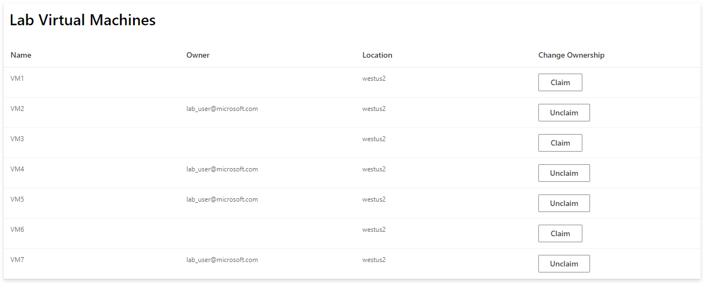

# Simple UI Sample Project



## Overview
The sample provided uses an ASP.NET Core web application with React for the user interface. 

## Setup and Deployment
### Create an App Registration for your client application in Azure Active Directory (AAD)
Before deploying this sample you will need to create an App Registration. This App Registration represents the identity of your client application, and will enable you to authenticate with the user's credentials to various Azure services (namely, DevTest Labs in this example). 
1. [Follow these instructions to register your application.](https://docs.microsoft.com/en-us/azure/active-directory/develop/quickstart-register-app) You will want to select the "Single-page application" tile when configuring platform settings.
2. In the management panel of your app registration, select *API permissions* > *Add a permission* > *Azure Service Management*
3. Select the *user_impersonation* permission
4. Select *Add permissions* to complete

_Note: Some AAD tenants may be configured such that you need an organization admin to grant approval for your app registration permissions. More details are available in the [AAD documentation](https://docs.microsoft.com/en-us/azure/active-directory/manage-apps/grant-admin-consent)._

### Replace the placeholder settings with your own
1. Navigate to the App Registration that you created in the previous step. Copy the **Application (client) ID** and the **Directory (tenant) ID** into the file `ClientApp/.env`:
```
REACT_APP_AAD_CLIENT_ID=00000000-0000-0000-0000-000000000000
REACT_APP_AAD_TENANT_ID=00000000-0000-0000-0000-000000000000
```
2. Next, navigate to your DevTest Lab in the Azure portal. Copy the **lab name, resource group name, and subscription ID** into the `appsettings.json` file. Once you have deployed the application to Azure, you can also set these values in the portal itself by following the instructions [here](https://docs.microsoft.com/en-us/azure/app-service/configure-common).

### Deploy the application to Azure
Right-click the SimpleDtlUI project in Visual Studio, and select *Publish*. [Step-by-step instructions](https://docs.microsoft.com/en-US/visualstudio/deployment/quickstart-deploy-to-azure?view=vs-2019) for navigating the Publish workflow are available in the Visual Studio documentation.

Deployments for your Azure web app can be automated via the [Azure DevOps Pipelines](https://docs.microsoft.com/en-us/azure/devops/pipelines/targets/webapp?view=azure-devops&tabs=yaml) or [Github Actions](https://github.com/marketplace/actions/azure-webapp).